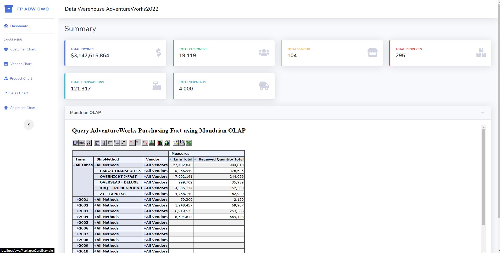

# FP_DWO_KELOMPOK_2

*FINAL PROJECT MATA KULIAH DATA WAREHOUSE - SEMESTER 6*

Perkenalkan kami dari kelompok 2 Paralel C yang terdiri dari :
1. Ardianti Amalia			[19082010023] 
2. Bagaskara Antaris	[19082010094] (Ketua Kelompok)
3. Rifat Hafiz Aditya	 	[19082010095] 
4. Hil Dina Mulya Dewi		[19082010120]
5. Rico Satria Fandi			[19082010104]

Langkah-langkah yang dibutuhkan untuk menjalankan app dengan baik :

1. Install database server: MySql (XAMPP versi terbaru).
2. Install software mysql management: phpMyAdmin dari XAMPP (ATAU YG LAIN).
3. Extract FP_DWO_KELOMPOK_2.zip pada folder direktori htdocs XAMPP (xampp/htdocs).
4. Jalankan XAMPP control panel.
5. Start apache,mysql server, dan tomcat.
6. Buka di browser ketik phpMyAdmin (http://localhost/phpmyadmin) enter.
7. Buat database dengan nama `deweo`.
8. Import file `deweo.sql` ke dalam database `deweo`.
9. Pindahkan file `jsp` dan `xml` (`sales_fact` , `purchase_fact`) yang ada pada folder mondrian pindahkan kedalam folder  -> `C:\xampp\tomcat\webapps\mondrian\WEB-INF\queries`.
10. Pindahkan file `testpage.jsp` dan `index` (`jsp` , `html`) yang ada pada folder mondrian pindahkan kedalam folder -> `C:\xampp\tomcat\webapps\mondrian`.
11. Jalankan aplikasi dengan mengakses (http://localhost/FP_DWO_KELOMPOK_2/).

# Screenshot 
## Dashboard Menu

