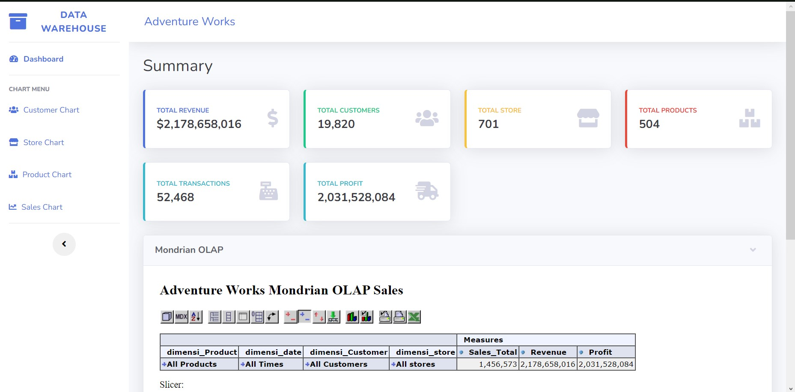

# FP_DWO_KELOMPOK_4

*FINAL PROJECT MATA KULIAH DATA WAREHOUSE - SEMESTER 4*

Perkenalkan kami dari kelompok 4 Paralel B yang terdiri dari :
1. Heni Lusiana Dewi 	(21082010060)
2. Izra Noor Zahara Aliya 	(21082010065)
3. Cendana Putri Aulia 	(21082010074)
4. Moh Raihan Romadhoni 	(21082010080)
5. Siti Oktavia Eka Putri 	(21082010081)

Langkah-langkah yang dibutuhkan untuk menjalankan app dengan baik :

1. Install database server: MySql (XAMPP versi terbaru).
2. Install software mysql management: phpMyAdmin dari XAMPP (ATAU YG LAIN).
3. Extract FP_DWO_KELOMPOK_4.zip pada folder direktori htdocs XAMPP (xampp/htdocs).
5. Jalankan XAMPP control panel.
6. Start apache,mysql server, dan tomcat.
7. Buka di browser ketik phpMyAdmin (http://localhost/phpmyadmin) enter.
8. Buat database dengan nama `whadventure2019`.
9. Import file `deweo.sql` ke dalam database `deweo`.
10. Pindahkan file `jsp` dan `xml` (`sales_fact` , `purchase_fact`) yang ada pada folder mondrian pindahkan kedalam folder  -> `C:\xampp\tomcat\webapps\mondrian\WEB-INF\queries`.
11. Pindahkan file `testpage.jsp` dan `index` (`jsp` , `html`) yang ada pada folder mondrian pindahkan kedalam folder -> `C:\xampp\tomcat\webapps\mondrian`.
12. Jalankan aplikasi dengan mengakses (http://localhost/FP_DWO_KELOMPOK_2/).

# Screenshot 
## Dashboard Menu

